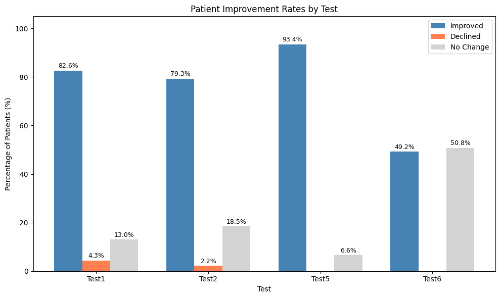
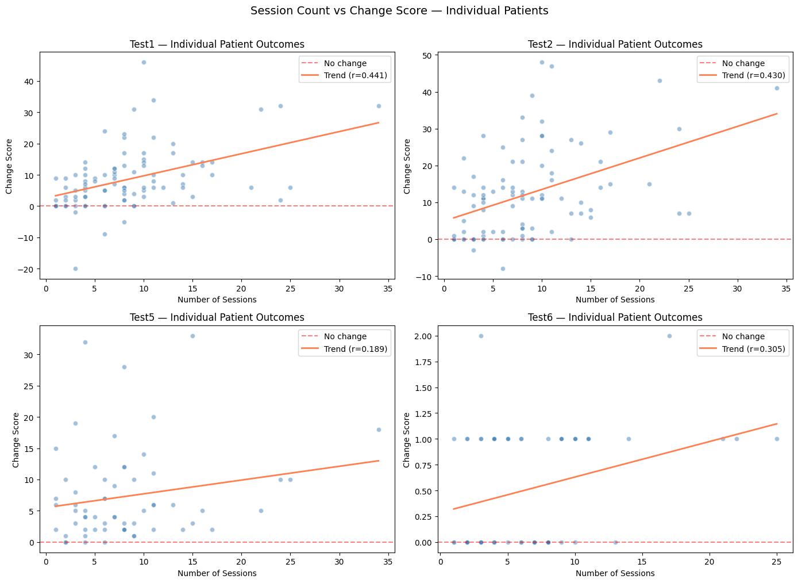
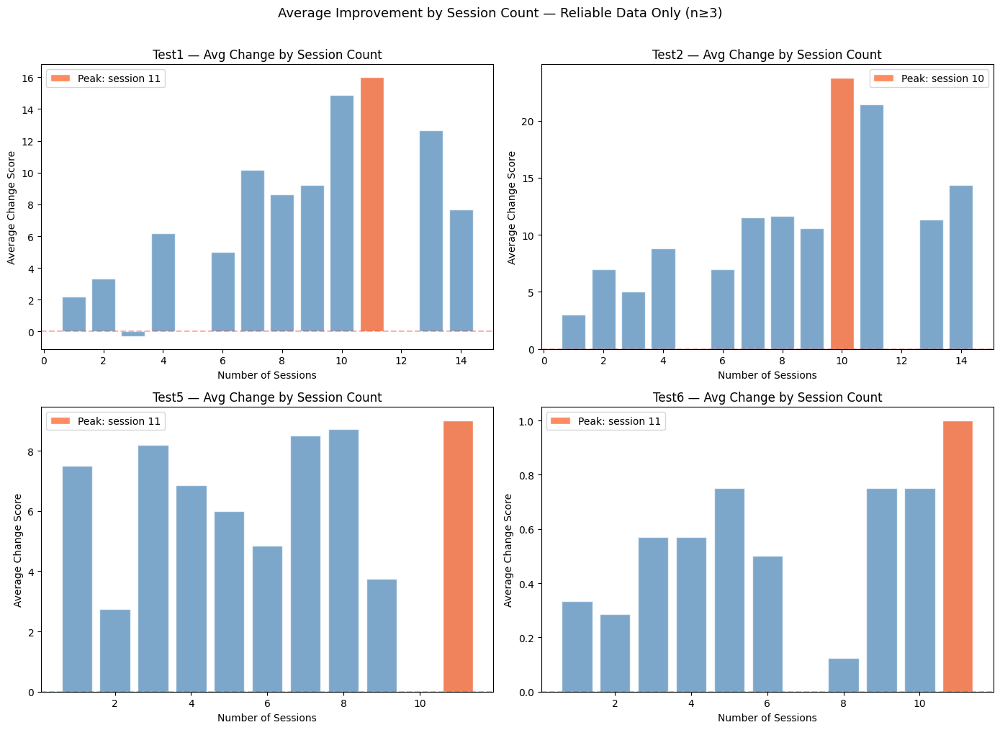

# Treatment Effectiveness Analysis

## Overview
This project evaluates the effectiveness of rehabilitation programmes using patient outcome data. By analysing the results of six clinical tests conducted across multiple sessions, the goal is to uncover patterns that inform evidence-based rehabilitation planning.  

The analysis uses Python, statistical methods, and visualisations to provide actionable insights into treatment outcomes.

---

## Key Insights
- **Rehabilitation is broadly effective:** Most patients improved across all measures, with minimal decline rates.  
- **Functional independence responds strongly:** Tests 1 and 2 showed moderate positive correlations with session count, indicating that more sessions enhance recovery.  
- **Optimal programme length:** Peak improvements occurred around **10–11 sessions**, suggesting a clinically meaningful target for rehabilitation scheduling.  

---

## Visualisations

### Patient Improvement Rates by Test
This chart illustrates the percentage of patients who improved, declined, or showed no change across each clinical test:

**Insights:**
- **Test5** shows the highest improvement rate at 93.4%, with no patients declining, highlighting significant gains in balance.  
- **Test1 and Test2** demonstrate strong improvement rates (over 79%), indicating meaningful recovery in daily living and independence.  
- **Test6** shows a lower improvement rate (49.2%), consistent with its ordinal scale; no patients declined.  
- Decline rates are consistently low, emphasizing safety and efficacy of the programme.

---

### Patient Improvement by Number of Sessions
This chart shows the average improvement in test scores relative to the number of sessions attended:

**Insights:**
- Peak improvements generally occur around 10–11 sessions across all tests.  
- Functional independence tests (Test1 and Test2) show moderate positive correlations with session count.  
- Balance improvements (Test5) and ordinal-scale tests (Test6) exhibit more modest gains but remain meaningful.  
- The data highlight the importance of consistent session attendance to maximise recovery.

---

### Average Improvement by Session Count
This chart shows the average change in test scores grouped by session count:

**Insights:**
- Average improvements peak around 10–11 sessions, confirming this as a critical threshold for rehabilitation.  
- Test1 and Test2 show the most pronounced gains with increased sessions.  
- Test5 and Test6 show smaller improvements but positive trends, suggesting patient-specific factors influence outcomes.  
- These patterns reinforce the importance of sustained engagement for consistent functional recovery.

---

## Tools & Technologies
- **Programming & Analysis:** Python, Pandas, NumPy  
- **Data Visualisation:** Matplotlib, Seaborn  
- **Environment:** Jupyter Notebook  

---

## Methodology
1. **Data Cleaning:** Removed tests with insufficient sample sizes (<30) to ensure reliable analysis.  
2. **Exploratory Analysis:** Evaluated pre/post scores, distribution patterns, and relationships with session count.  
3. **Statistical Analysis:** Calculated improvement percentages, correlations with session counts, and peak performance sessions.  
4. **Visualisation:** Produced charts showing distributions, trends, and session-based improvements for actionable insights.

---

## Takeaways
- Structured rehabilitation improves outcomes across multiple functional domains.  
- Consistent session participation (around 10–11 sessions) maximises recovery.  
- Data-driven insights can guide rehabilitation programme design and individual patient care.
